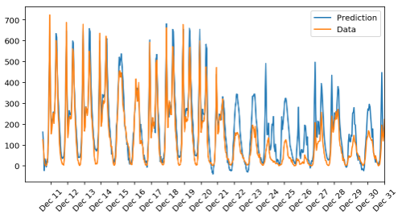
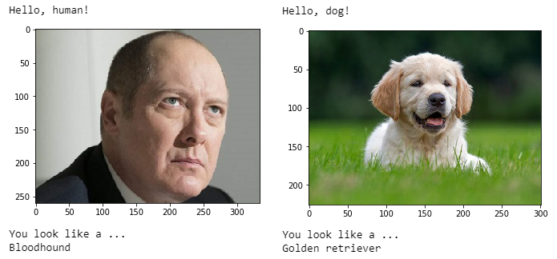
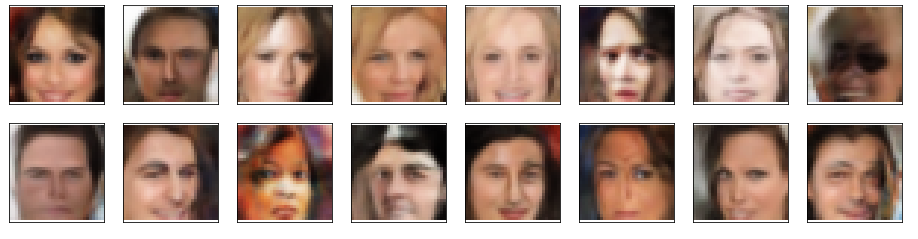

# Deep Learning Nanodegree Projects
This repository contains projects for the [Deep Learning Nanodegree](https://www.udacity.com/course/deep-learning-nanodegree--nd101) program.

## [Predicting Bike-Sharing Patterns](https://github.com/RoumaissaaMadoui/Deep-Learning-Nanodegree-Projects/tree/master/project-bikesharing)
Implement a neural network in NumPy to predict bike rentals.

## [Dog Breed Classifier](https://github.com/RoumaissaaMadoui/Deep-Learning-Nanodegree-Projects/tree/master/project-dog-classification)
Build a convolutional neural network with PyTorch to classify any image (even an image of a face) as a specific dog breed.

## [TV Script Generation](https://github.com/RoumaissaaMadoui/Deep-Learning-Nanodegree-Projects/tree/master/project-tv-script-generation)
Train a recurrent neural network to generate scripts in the style of dialogue from Seinfeld.

> jerry: so, what was the problem?

> elaine: no, i didnt have a good time.

> jerry: what did you do?

> george: well, they gave us

## [Face Generation](https://github.com/RoumaissaaMadoui/Deep-Learning-Nanodegree-Projects/tree/master/project-face-generation)
Use a DCGAN on the CelebA dataset to generate images of new and realistic human faces.

## [Deploying a Sentiment Analysis Model](https://github.com/RoumaissaaMadoui/Deep-Learning-Nanodegree-Projects/tree/master/deploying-a-sentiment-analysis-model)
Learn to deploy pre-trained models using AWS SageMaker.

## Licence

The contents of this repository are covered under the [MIT License](https://github.com/RoumaissaaMadoui/Deep-Learning-Nanodegree-Projects/blob/master/LICENSE).

